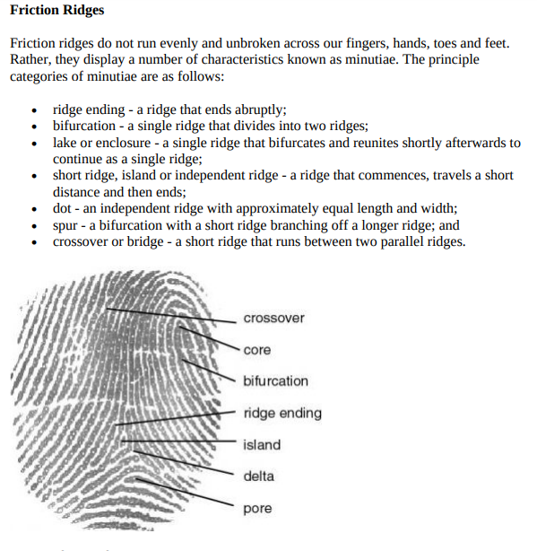
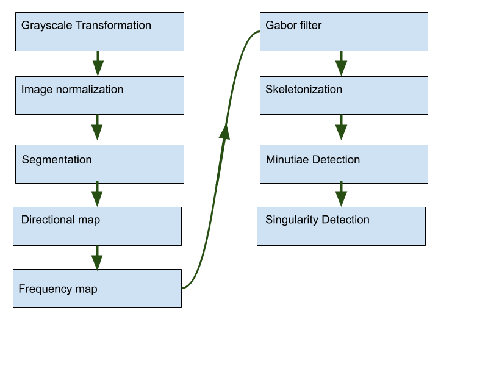
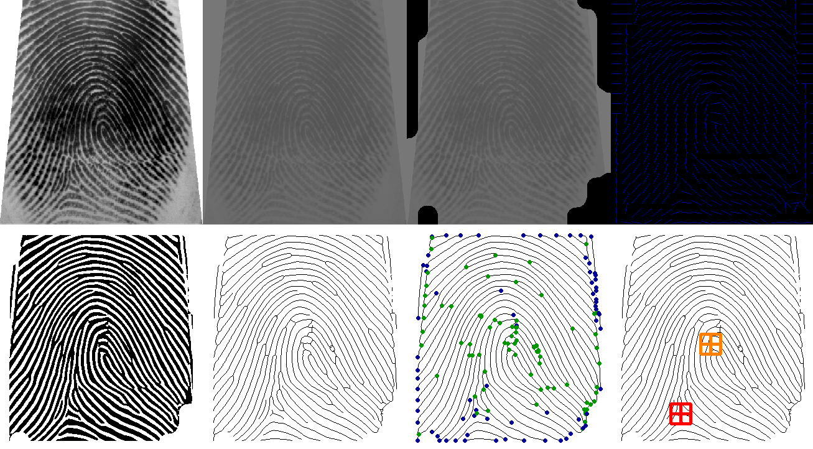

# Fingerprint recognition algorithms

[comparation guide](http://flash.lakeheadu.ca/~lubiotec/Fingerprints%20Comparison%20Guide.pdf)

## Summary

This repository proposes a fingerprint recognition chain based on 
based on generic algorithms and tools for filtering images. 
The results are retrieved and validated using Python. 

### Prerequisites

* python 3.7
* python opencv

### How to use it

install requirement

    pip install --user --requirement requirements.txt

**Run fingerprint detection**. Finegerprint_pipline.py will process images
from './sample_inputs/' and results will be store at './output/' 
 
    python finegerprint_pipline.py
 
### Dataset 
Dataset ussed for this project can be found in this [LINK](http://bias.csr.unibo.it/fvc2002/download.asp)

### Algorithm Pipeline
The techniques of fingerprint recognition image enhancement are based on 
Gabor Filters process, normalization, segmentation of ridge region, 
morphological thinning and estimation of the local orientation of 
ridges in a fingerprint. 

### Results
The following image shows pipeline results at each step

Ending (Green) -
Bifurcation (Blue) -
Delta (Red) -
Loop (Orange) - 
Whorl (Pink)

### Reference 

- [Fingerprint Recognition Algorithm , Farah Dhib Tatar](https://airccj.org/CSCP/vol7/csit76809.pdf)
- [Fingerprint Singular Point Detection Algorithm by Poincaré Index, Jin Bo, Tang Hua Ping, Xu Ming Lan](https://pdfs.semanticscholar.org/6e86/1d0b58bdf7e2e2bb0ecbf274cee6974fe13f.pdf)
- [Fingerprint Recognition: A study on image enhancement and minutiae extraction](https://pdfs.semanticscholar.org/ca0d/a7c552877e30e1c5d87dfcfb8b5972b0acd9.pdf)
- [Handbook of Fingerprint Recognition, Autorzy Davide Maltoni, Dario Maio, Anil K. Jain, Salil ]()
- [Biometrics by rtshadow](https://github.com/rtshadow/biometrics)
- [Fingerprint enhancement by Utkarsh-Deshmukh](https://github.com/Utkarsh-Deshmukh/Fingerprint-Enhancement-Python) 
- [Dataset from FVC2002](http://bias.csr.unibo.it/fvc2002/download.asp)
