<html><body class="c7"><h1 class="c1" id="h.t64xc7du9pb9">Pipeline</h1><h1 class="c1" id="h.ogn9kvxu0o">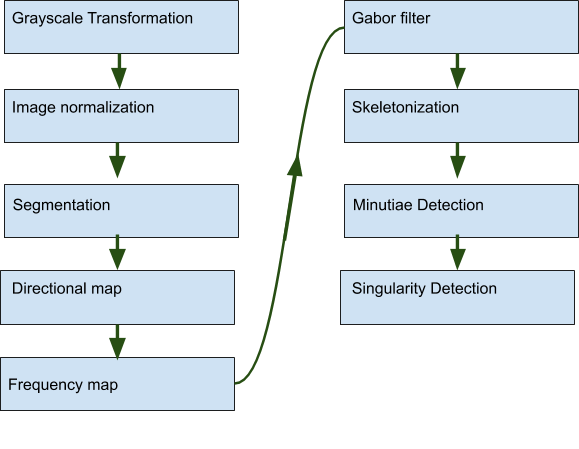&nbsp;</h1><h1 class="c1" id="h.b7sx8zwkjale">Normalization</h1>
Normalization is used to standardize the intensity values due to sensor noise and finger pressure in an image by adjusting the range of gray level values so that they extend in a desired range of values and improve the contrast of the image. The main goal of normalization is to reduce the variance of the gray level value to facilitate subsequent processing steps.

Normalization is a pixel-wise operation which does not change the clarity of the ridge and furrow structures. If normalization is done on the entire image, then it cannot compensate for the intensity variations in the different parts of the finger due to finger pressure differences. Normalization of each block separately alleviates this problem. 

The method used by Hong, Wan, and Jain (1998), known as adaptive normalization can be seen as:
<table class="c4"><tbody><tr class="c15"><td class="c18" colspan="1" rowspan="1">
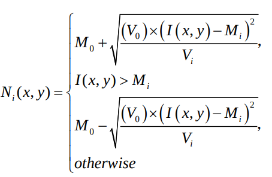
</td><td class="c13" colspan="1" rowspan="1">
where M0 and V0 are the desired mean and variance values, respectively. &nbsp;Let I(x, y) denote the gray value at pixel (x, y), Mi and Vi, the estimated mean and variance. Ni(x, y), the normalized gray-level value at pixel (x, y). 

</td></tr></tbody></table><h1 class="c1" id="h.uejqyl2onydm">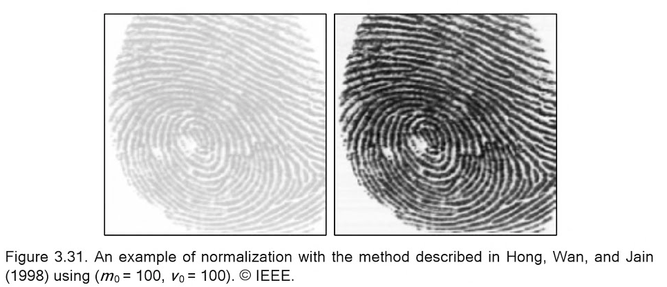</h1><h1 class="c1" id="h.6czlgrg29f9x">Segmentation</h1>
To define the ROI a mask is created using blockwise coherence to segment the ridges from the background. There are more robust methods for segmentation[1] however the method I used is based on the calculation of the variance of gray levels. Image is divided into sub-blocks of (W &times; W) size&rsquo;s and for each block, the variance is calculated. 

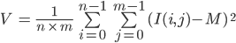

Then, the root of the variance of each block is compared with a threshold T based on the global variance of the image, if the value obtained is lower than the threshold, then the corresponding block is considered as the background of the image and will be excluded by the subsequent processing. Otherwise, the block will be considered as a useful part of the image. The selected threshold value for this repository is T = 0.2*std(image) and the selected block size is W = 16 [7]. This step makes it possible to reduce the size of the useful part of the image and subsequently to optimize the extraction phase of the biometric data. 

After the mask is created, the mask is smooth with an open/close morphological filter, to eliminate possible mask outliers. Two Morphological operations called &lsquo;OPEN&rsquo; and &lsquo;CLOSE&rsquo; are adopted. The &lsquo;OPEN&rsquo; operation can expand images and remove peaks introduced by background noise. The &lsquo;CLOSE&rsquo; operation can shrink images and eliminate small cavities.

Image normalization is calculated based on the segmented image.
<h1 class="c1" id="h.vz4nscctl87g">Orientation field</h1>

<table class="c4"><tbody><tr class="c8"><td class="c19" colspan="1" rowspan="1">
Sobel filters were used to obtain the direction of the field. The 3 by 3 operators Gx and Gy are used to obtain the gradients in horizontal and vertical directions.

Thus, the local direction in the vicinity V, in the direction of the lines (Vx (i, j)) and in the direction of the columns (Vy (i, j)) is estimated by the following calculation: 
</td><td class="c16" colspan="1" rowspan="1">
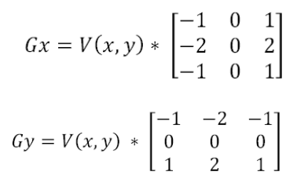
</td></tr></tbody></table>

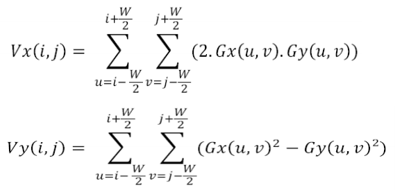

The estimation of the local orientation in the neighborhood V is &#1138; (i, j) such that: 

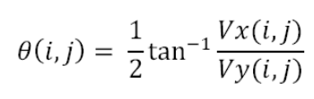

For fingerprint images, the average width of the ridge or valley is five to eight pixels, so W1 = 16 gives a good orientation estimate and saves computational time. 

There are two reasons for the failure of the orientation measure [11]. The neighborhood may contain a constant gray value area or an isotropic gray value structure without a preferred orientation. To distinguish these two cases we need to compare the magnitude of the orientation vector with the mean square magnitude of the gradient. 

The directional map defines the local orientation of the striates contained in the impression. The estimation of orientation is a fundamental step in the process of image enhancement based on Gabor&#39;s filtering. (figure 3) 

<h1 class="c1" id="h.8p34vdgbxw44">Frequency map</h1>
Calculation of a frequency block In addition to the directional map we must have the local estimation of the frequency map to be able to construct the Gabor filter. The frequency map of the image consists of estimating the local frequency of the streaks in each pixel. The steps in the frequency estimation stage are:

<ol class="c14 lst-kix_54x5fpisxhpm-0 start" start="1"><li class="c5 c12">Divide the image into blocks of size W&times;W. </li><li class="c5 c12">Project the pixels located inside each block along a direction orthogonal to the local ridge orientation. It forms an almost sinusoidal-shape wave with the local minimum points corresponding to the ridges in the fingerprint.</li><li class="c5 c12">Calculate the ridge spacing by counting the number of pixels between consecutive minima points&nbsp;in the projected waveform. If the block contains at less than two maxima the period is set to zero and it is considered noise. The maxima are the centers of the streaks and the minima are the centers of the valleys. The set of successive maxima and minima represents what is called extrema. </li><li class="c5 c12">Determine the wavelength(T) by dividing the distance from the first peak to the last peak, if the wavelength is outside the allowed bounds, the frequency image is set to zero</li><li class="c5 c12">Calculate the&nbsp;frequency by the ratio (1 / T)&nbsp;where T represents the period calculated between two successive extrema. </li></ol><h1 class="c10" id="h.adlv4r13r8f4">Gabor Filter</h1>
Hong, Wan, and Jain [10] proposed an effective method based on Gabor filters. Gabor filters have both frequency-selective and orientation-selective properties and have an optimal joint resolution in both spatial and frequency domains. A graphical representation of a bank of 24 filters and an example of their applications is shown below. Further information on the huge number of existing fingerprint enhancement and binarization techniques can be found in [2]. 
<h1 class="c10" id="h.7dj5ied2vnge">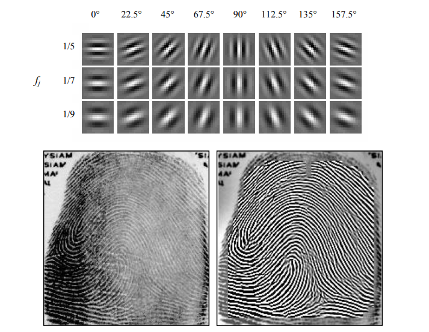</h1>
The principle of filtering is to modify the value of the pixels of an image, generally in order to improve its appearance. In practice, it is a matter of creating a new image using the pixel values of the original image, in order to select in the Fourier domain the set of frequencies that make up the region to be detected. The filter used is the Gabor filter with even symmetry and oriented at 0 degrees (formula 15): 

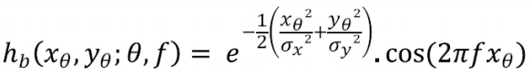

The values of &nbsp;&nbsp;&nbsp;&nbsp;&nbsp;&nbsp;&nbsp;&nbsp;and &nbsp;are chosen such that &nbsp;= . F(i,j) and &nbsp;= &nbsp;&nbsp;&nbsp;&nbsp;&nbsp;&nbsp;&nbsp;&nbsp;&nbsp; . F(i,j). The values of &nbsp;and &nbsp;are fixed to be 0.5. To obtain other orientations, it is sufficient to carry out a rotation of the coordinate axes according to the formula: 

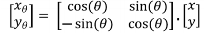

According to the different blocks of the image, the filter can have several favored directions. In this case, the final filter is a sum of basic filters placed in each direction. The resulting image will be the spatial convolution of the original (normalized) image and one of the base filters in the direction and local frequency from the two directional and frequency maps: 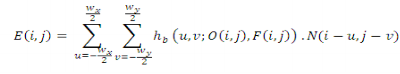

with : - E(i,j) is the new value of the pixel (i, j) - O(i,j) and F(i,j) Are the values of the pixels (i, j) of the directional and frequency maps. - &nbsp;and &nbsp;Are respectively the length and the width of the block used for the convolution. 
<h1 class="c1" id="h.bpatqnf42gsu">Thinning </h1>
To facilitate extraction of minutiae the image must be skeletonized: a sequence of morphological

erosion operations are used to eliminate the redundant pixels of ridges until the ridges are just one pixel wide. While some papers use Rosenfeld algorithm for its simplicity[3]. I used skimage Zha84 A fast parallel algorithm for thinning digital patterns[4]
<h1 class="c10" id="h.rsfq214vcxq7">Minutiae extraction</h1>
Crossing number method is a really simple way to detect ridge endings and ridge bifurcations. The crossing number algorithm will look at 3x3 pixel blocks. The value of the CN is calculated according to formula 18: [5][6]

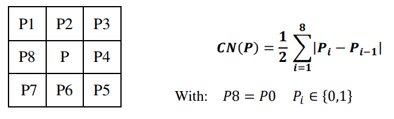

&nbsp; &nbsp; if the middle pixel is black (represents ridge):

&nbsp; &nbsp; if the pixel on boundary crossed the ridge&nbsp;once, then we&#39;ve found ridge ending

&nbsp; &nbsp; if the pixel on boundary crossed the ridge three&nbsp;times, then we&#39;ve found&nbsp;ridge bifurcation

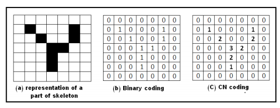

There are other minutiae extraction approaches that work directly on the gray-scale images without binarization and thinning. This choice is motivated by these considerations: 
<ul class="c14 lst-kix_12ovn5ned4s5-0 start"><li class="c5 c12">information may be lost during the binarization process </li><li class="c5 c12">binarization and thinning are time-consuming</li></ul>
Maio and Maltoni [8] proposed a direct gray-scale minutiae extraction technique that may be worth looking at it. &nbsp;
<h1 class="c1" id="h.x3mlzaih89lq">Singularities </h1>
Uses the Poincar&eacute; index method proposed by Kawagoe and Tojo (1984).

Let G be the field associated with a fingerprint orientation and let [i,j] be the position of the element. Computed as follows. 

&bull; The curve C is a closed path defined as an ordered sequence of some elements of D, such that [i,j] is an internal point;

&nbsp;&bull; PG, C(i,j) is computed by algebraically summing the orientation differences between adjacent elements of C. 

It is well known and can be easily shown that, on closed curves, the Poincar&eacute; index assumes only one of the discrete values: 0&deg;, &plusmn;180&deg;, and &plusmn;360&deg;. In the case of fingerprint singularities: 

0&deg; = does not belong to any singular region.

360&deg; belongs to a whorl type singular region 

180&deg; belongs to a loop type singular region

-180&deg; belongs to a delta type singular region

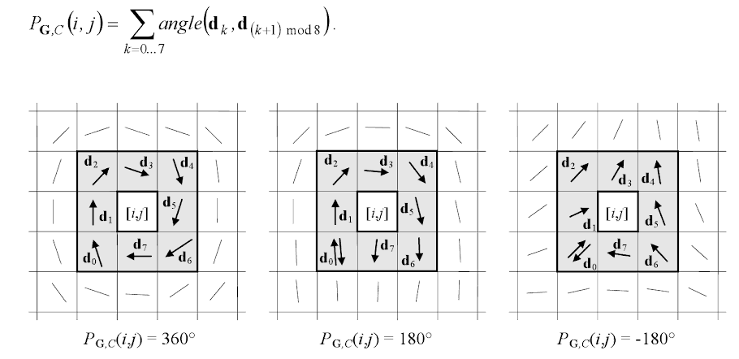

References:

[1] Bazen, A.M., Gerez, S.H.: Segmentation of Fingerprint Images. Proc. Workshop on Circuits Systems and Signal Processing (ProRISC 2001) (2001) 276&minus;280. 

[2] Maltoni, D., Maio, D., Jain, A.K., Prabhakar, S.: Handbook of Fingerprint Recognition, Springer, New York (2003).

[3] Farah Dhib Tatar, &ldquo;Finger Recognition Algorithm&rdquo;

[4] T. Y. Zhang and C. Y. Suen, Communications of the ACM, March 1984, Volume 27, Number 3.

[5] Jin Bo, Tang Hua Ping, Xu Ming Lan, &nbsp;&ldquo;Fingerprint Singular Point Detection Algorithm by Poincar&eacute; Index&rdquo;

[6] A.K. Jain, S. Prabhakar and S. Pankanti, &quot;Twin Test: On Discriminability of Fingerprints&quot;, Proc. 3rd International Conference on Audio- and Video-Based Person Authentication, pp. 211-216, Sweden, June 6-8, 2007. 

[7] A.K. Jain, S. Prabhakar and S. Pankanti, &quot;Twin Test: On Discriminability of Fingerprints&quot;, Proc. 3rd International Conference on Audio- and Video-Based Person Authentication,, pp. 211-216, Sweden, June 6-8, 2007. 

[8] Maio, D., Maltoni, D.: Ridge-Line Density Estimation in Digital Images. Proc. Int. Conf. on Pattern Recognition (14th) (1998) 534&minus;538. 
</body></html>
